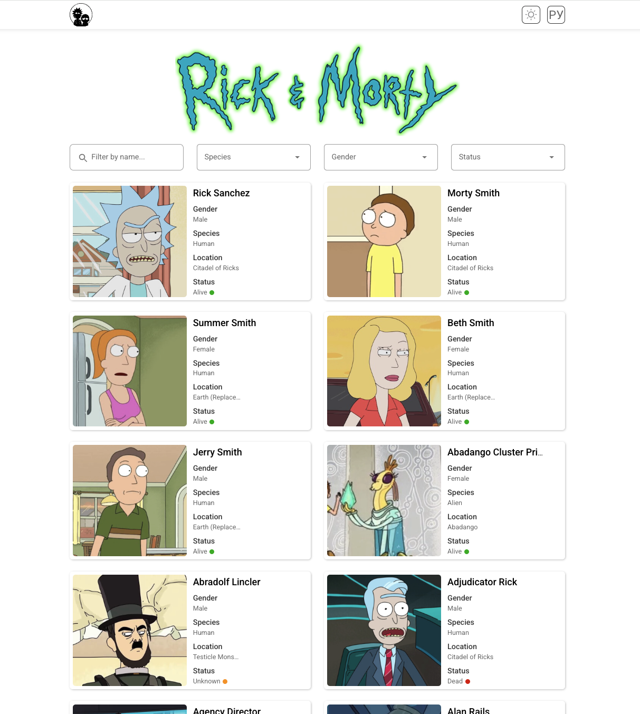
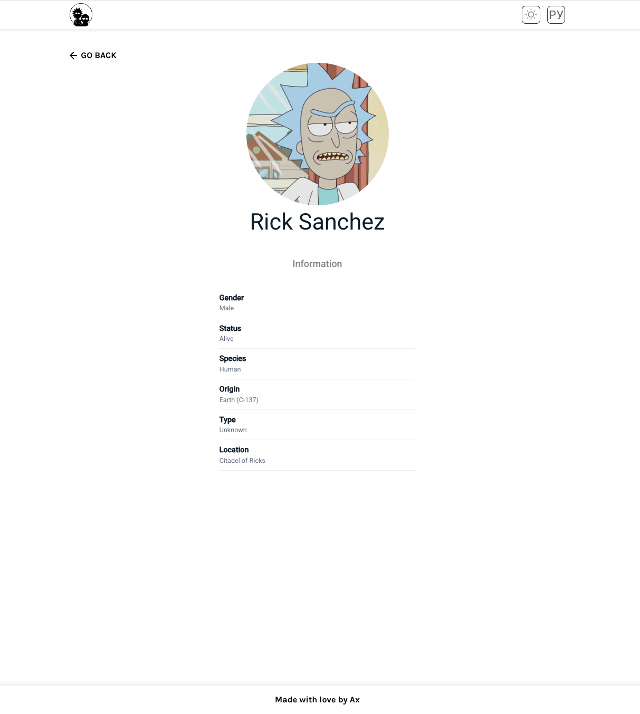
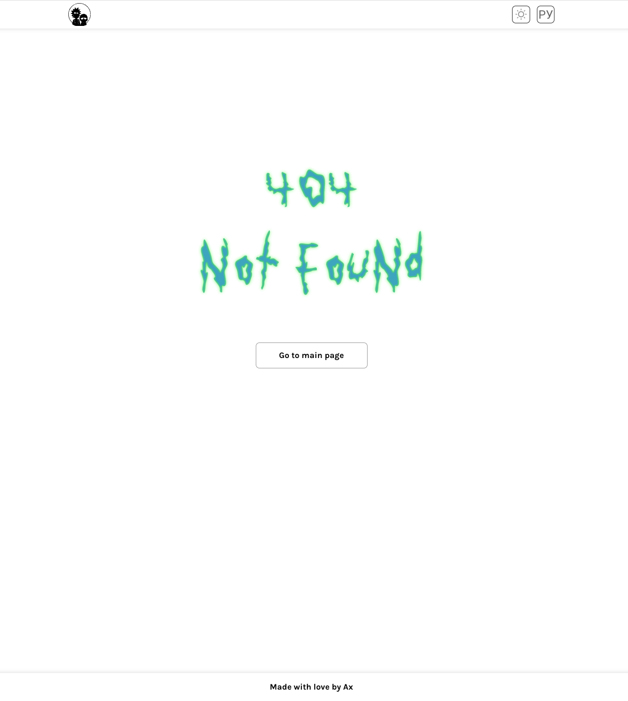

# 🛸 Rick & Morty App


Интерактивное SPA-приложение по вселенной **Rick and Morty**, написанное на **React 19 + TypeScript + Vite**.  
Проект использует публичное Rick and Morty API, поддерживает фильтрацию, бесконечную прокрутку, редактирование карточек и отдельную страницу персонажа.

---

## 🔗 Демо

**GitHub Pages:**  
👉 [https://alexandrmetelkovit.github.io/rim/](https://alexandrmetelkovit.github.io/rim/)

---

## 📸 Скриншоты

### Список персонажей



### Страница персонажа



### 404



---

## 🚀 Возможности

### 🧬 Список персонажей

- Загрузка данных из Rick and Morty API
- Бесконечная прокрутка (IntersectionObserver)
- Ленивая загрузка изображений
- Отображение имени, статуса, вида, пола и локации
- Кружок статуса (Alive / Dead / Unknown) с цветовой индикацией

### 🔎 Фильтрация

Фильтры работают через API и мгновенно обновляют список:

- Имя (с debounce 500 мс)
- Вид (Species)
- Пол (Gender)
- Статус (Alive / Dead / Unknown)

### ✏️ Редактирование карточек

Прямо в списке персонажей можно изменить:

- Имя
- Локацию
- Статус

Все изменения сохраняются в локальном состоянии списка (API read-only, поэтому сохранение эмулируется локально).
Есть кнопки **Reset** и **Done**, а также режим редактирования по иконке.

### 📄 Страница персонажа

Отдельная страница `/character/:id` с детальной информацией:

- Фото
- Имя
- Пол
- Вид
- Статус
- Origin
- Type
- Location

Данные загружаются напрямую из API (не берутся из отредактированного списка).

### ⚠️ Обработка ошибок

- Страница 404 для несуществующих маршрутов
- Редирект на 404 при запросе несуществующего персонажа
- ErrorBoundary + ErrorFallback для защиты от падения приложения
- Тосты через `react-hot-toast` для ошибок загрузки

---

## 🛠️ Технологии

| Технология       | Версия |
| ---------------- | ------ |
| React            | 19.x   |
| React DOM        | 19.x   |
| TypeScript       | 5.x    |
| Vite             | 8.x    |
| React Router DOM | 7.x    |
| Axios            | 1.x    |
| Sass (SCSS)      | 1.x    |
| react-hot-toast  | 2.x    |
| vite-plugin-svgr | 5.x    |
| ESLint           | 9.x    |
| Stylelint        | 17.x   |
| Prettier         | 3.x    |

---

## 📦 Установка и запуск

### 1. Клонирование репозитория

```bash
git clone https://github.com/alexandrmetelkovit/rim.git
cd rim
```

### 2. Установка зависимостей

```bash
npm install
```

### Приложение будет доступно по адресу:

```text
http://localhost:5173/
```

### 3. Запуск в режиме разработки

```bash
npm run dev
```

### 4. Сборка проекта

```bash
npm run build
```

### 5. Предпросмотр собранной версии

```bash
npm run preview
```

---

## Линтинг и форматирование

Проект использует ESLint, Stylelint и Prettier.

### Проверка кода (TS/TSX)

```bash
npm run lint
```

### Автоисправление TS/TSX

```bash
npm run lint:fix
```

### Проверка SCSS

```bash
npm run lint:style
```

### Автоисправление SCSS

```bash
npm run lint:style:fix
```

### Проверка форматирования

```bash
npm run format:check
```

### Автоформатирование

```bash
npm run format
```

---

## Деплой на GitHub Pages

Проект деплоится автоматически через GitHub Actions при пуше в ветку `master`.

Workflow находится здесь:

```text
.github/workflows/deploy.yml
```

Для корректной работы SPA на GitHub Pages в проекте настроены:

- `base: '/rim/'` в vite.config.ts
- `basename: import.meta.env.BASE_URL` в React Router
- `public/404.html` — для корректной обработки клиентского роутинга при обновлении страницы

После пуша в `master`:

GitHub Actions собирает проект.

Публикует `dist/` в GitHub Pages.

Сайт доступен по ссылке выше.

---

## Структура проекта (FSD)

```text
src/
├── app/
│   ├── layouts/
│   │   ├── Header/
│   │   ├── Footer/
│   │   └── Layout/
│   ├── router/
│   ├── styles/
│   └── App.tsx
├── pages/
│   ├── CharacterPage/
│   ├── CharactersPage/
│   └── NotFoundPage/
├── widgets/
│   ├── CharacterCard/
│   ├── CharactersList/
│   └── FilterPanel/
├── shared/
│   ├── api/
│   ├── assets/
│   ├── constants/
│   ├── hooks/
│   ├── lib/
│   ├── types/
│   └── ui/
└── main.tsx
```

---

## Архитектурные решения

- `FSD (Feature-Sliced Design)` — слои app, pages, widgets, shared.
- `Кастомные хуки` — useCharacters, useCharacter, useFilters, useDebounce, useInfiniteScroll.
- `API-слой` — axios-инстанс + эндпоинты, отделённые от логики компонентов.
- `Нормализация данных` — normalizeStatus приводит статусы из API к внутреннему типу Status.
- `Оптимизация` — React.memo, useCallback для предотвращения лишних ререндеров.
- `Контролируемые компоненты` — Select, TextInput полностью управляются извне.
- `Композиция` — OptionComponent для кастомного рендера опций в Select.

---

## API

Используется публичное API:
👉 [Rick and Morty API](https://rickandmortyapi.com)

Особенности:

- Не требует авторизации
- Read-only (нет методов для сохранения изменений)
- Поддерживает фильтрацию и пагинацию

---

## Лицензия

Проект создан в учебных целях. Все персонажи принадлежат правообладателям Rick and Morty.

---

## 🗺️ Планы

**Оптимизация:**

- [ ] Применение хука useTransition
- [ ] Добавление стейт-менеджера
- [ ] Кэширование данных (RTK-query)

**Тестирование:**

- [ ] Unit-тесты (JEST)
- [ ] E2E-тесты (Playwright)
- [ ] Storybook и скриншотные тесты

**UX:**

- [ ] Тёмная тема
- [ ] Переключение на русский язык
- [ ] PWA и адаптив

**Инфраструктура:**

- [ ] Микрофронты
- [ ] Docker
